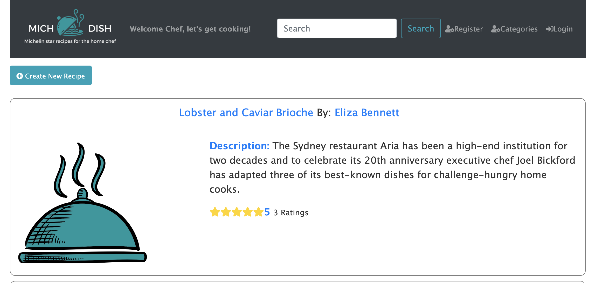
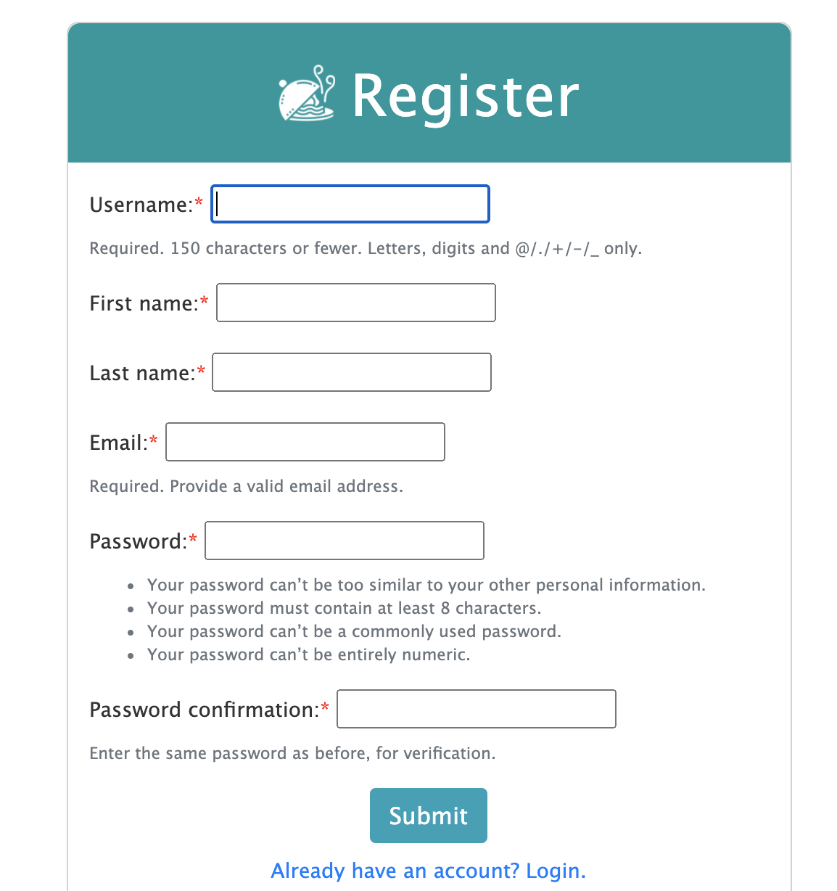
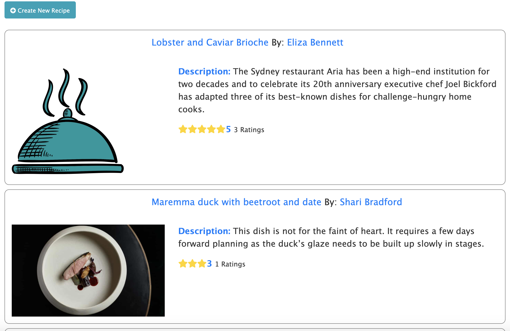
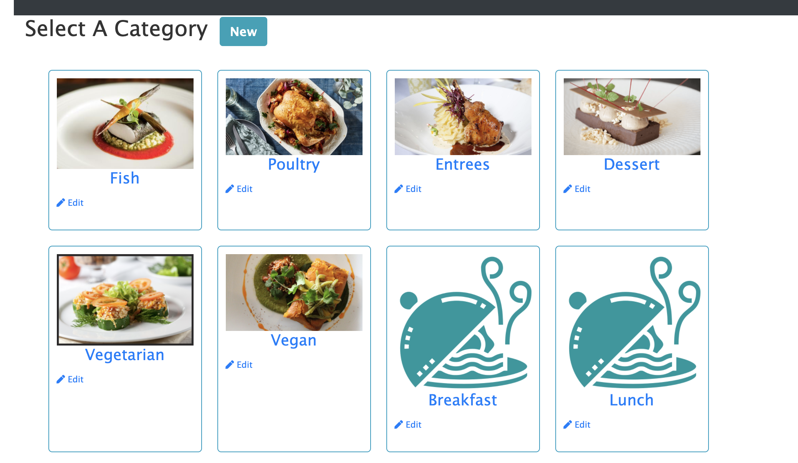
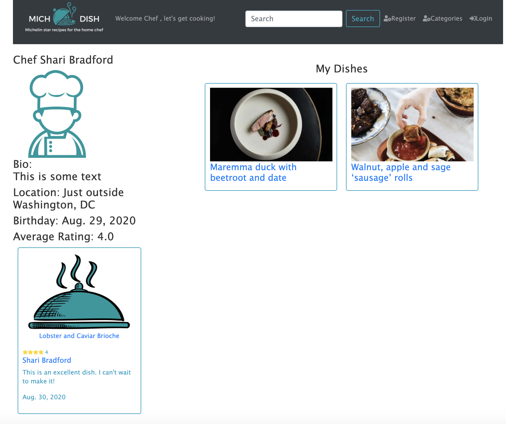
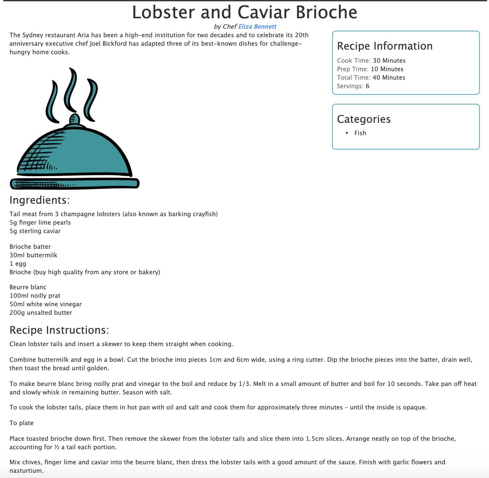
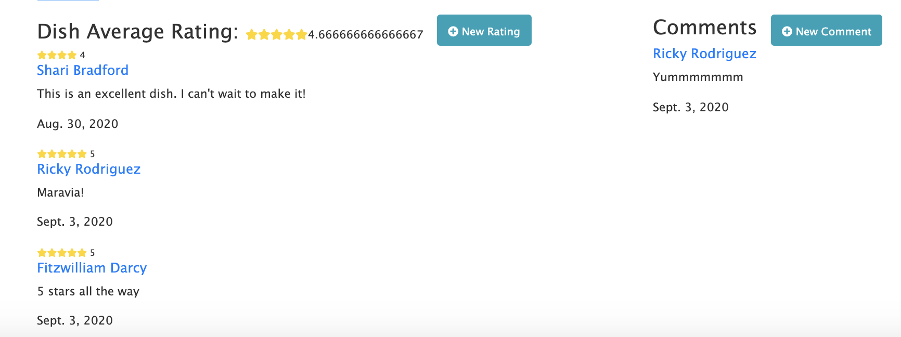

# michDish
Group Project

## MichDish
A fun resourceful web application to help you post your amazing recipes and have them reviewed by your peers. 

# Registration
Click on the register button 

Type in the requested information

# Browse
You will see the most recent post by other users on the dashboard

You may also browse by category

# Check out Other Chefs
You can check out individual chef profiles to see what dishes they have cooked up themselves and also what other reviews they have left for other chefs

# Dishes
When you click on a dish you will see all of the information about the dish and its recipe including the ingredients and instructions required along with the amount
of prep/cook time required.

# Reviews/Ratings
You will see each dish can be reviewed by a registered user. Once a user has revied you will see and updated star count computed by the average ratings for the dish.
